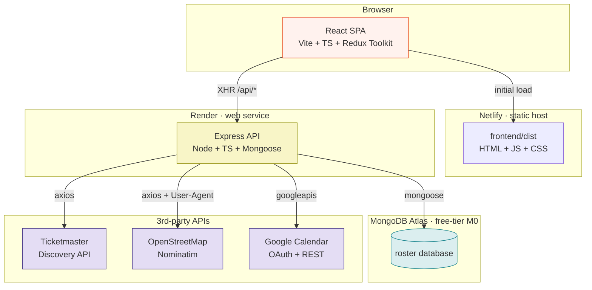
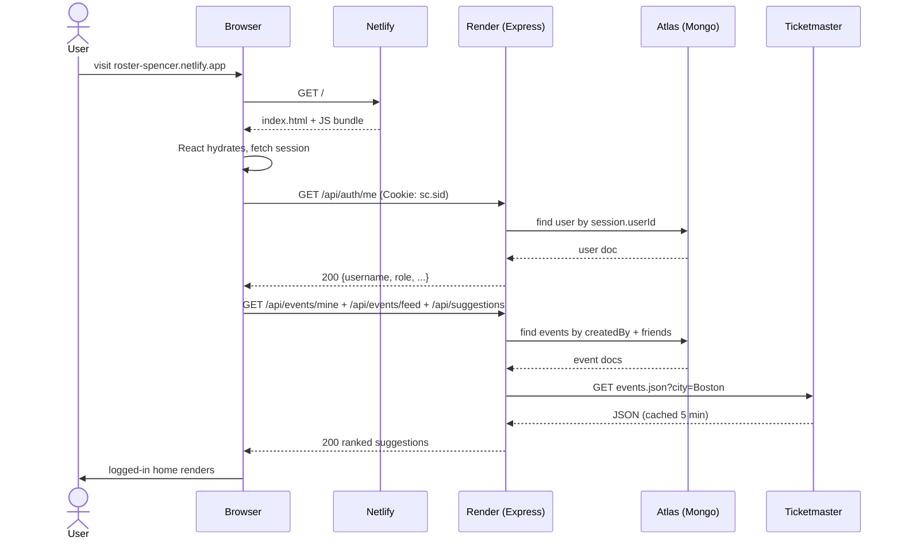
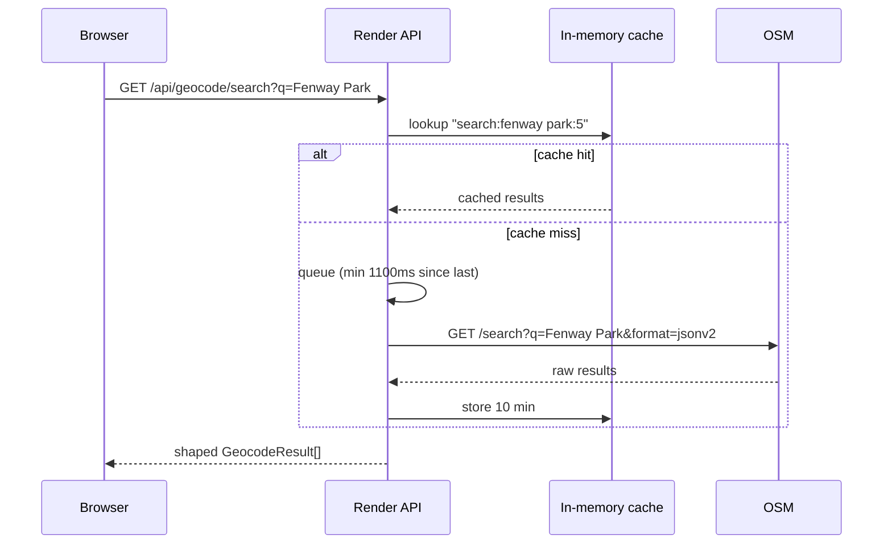
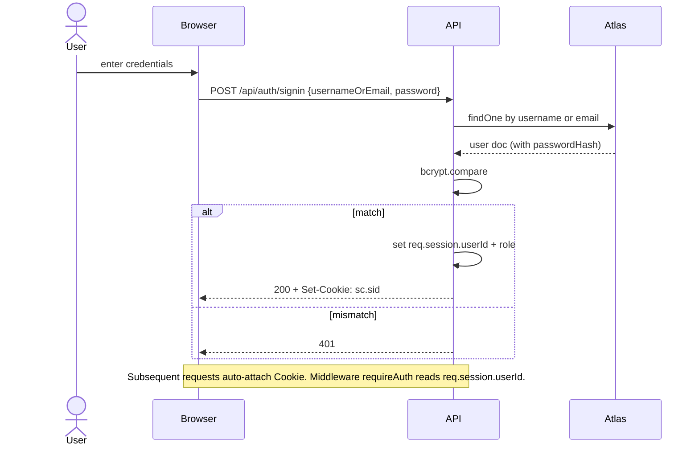
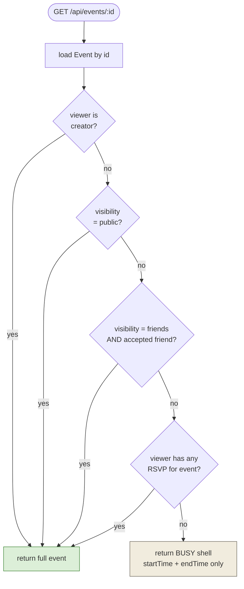
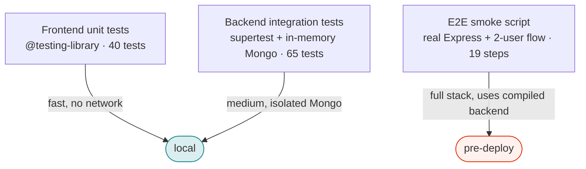

# System Architecture

Roster is a three-tier MERN app deployed across three services (Netlify, Render, Atlas) with two third-party API integrations (Ticketmaster, OpenStreetMap) and one optional OAuth integration (Google Calendar).

---

## Deployment topology

**Live URLs:**

| layer | url | stack |
|---|---|---|
| frontend | https://roster-spencer.netlify.app | React + Vite + TS |
| backend | https://roster-backend-cmvp.onrender.com | Node + Express + Mongoose |
| database | Atlas `Cluster0` (US_EAST_1) | MongoDB 8.x |

---

## Request flow · typical logged-in page load

---

## Request flow · 3rd-party API proxying

Both Ticketmaster and OSM are accessed through the backend — never directly from the browser — so:

1. API keys (Ticketmaster) live on Render only, not shipped in the frontend bundle.
2. We rate-limit and cache server-side: OSM at 1 req/sec, TM with a 5 min TTL.
3. User-Agent headers required by OSM are set consistently.

---

## Auth + session flow

Session-based (not JWT). `express-session` stores a signed cookie; session store is in-memory on Render (fine for single-instance free tier, would move to Redis for production scale).

---

## Privacy enforcement

Every read endpoint that returns event data runs through the same filter:

The RSVP check is how an **invited** user gains read access to a friends-only event even if they aren't actually friends with the creator yet — the invitation pre-authorizes them.

---

## Deploy pipeline

No CI/CD configured yet; deploys are manual via CLIs, but each target auto-configures from files in the repo:

- **Netlify** — [`frontend/netlify.toml`](../frontend/netlify.toml) sets build command + SPA redirect.
- **Render** — [`render.yaml`](../render.yaml) declares the service, env var names, and health check. Every push to `main` would auto-deploy if GitHub integration were connected (currently manual via `render deploys create`).
- **Atlas** — managed by Atlas CLI; cluster + db user + IP allowlist already provisioned.

---

## Test + smoke pyramid

- `cd backend && npm test` — runs the integration suite.
- `cd frontend && npm test` — runs the unit suite.
- `cd backend && npm run smoke` — spins up an in-memory Mongo, boots Express, and walks the full signup → friend → invite → RSVP → comment flow. Point it at a staging backend with `SMOKE_BASE=<url>` for post-deploy verification.
