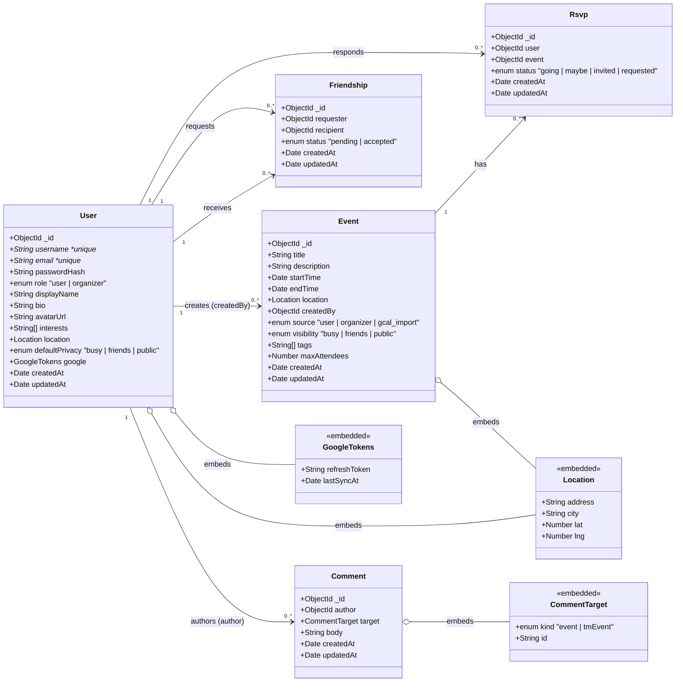
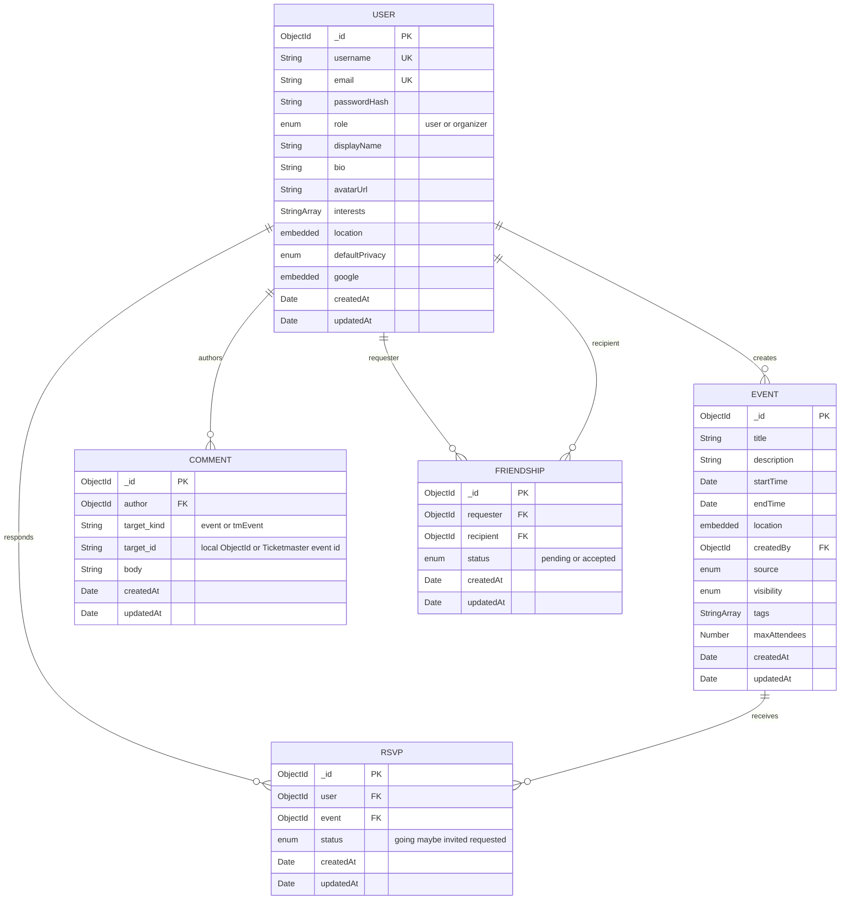

# Data Models

This doc specifies every domain object in Roster, their fields, and the relationships between them. Five Mongoose collections back the app.

---

## UML Class Diagram

**Relationships at a glance:**

| # | Relationship | Type | Backed by |
|---|---|---|---|
| 1 | User → Event | one-to-many | `Event.createdBy` foreign key |
| 2 | User → Comment | one-to-many | `Comment.author` foreign key |
| 3 | Event → Rsvp | one-to-many | `Rsvp.event` foreign key |
| 4 | Users ↔ Events | many-to-many | `Rsvp` join collection |
| 5 | Users ↔ Users | many-to-many | `Friendship` join collection (self-referential) |

---

## Entity-Relationship Diagram

---

## Field reference

### `User`
**Collection:** `users` · **File:** [`backend/src/models/User.ts`](../backend/src/models/User.ts)

| field | type | notes |
|---|---|---|
| `_id` | ObjectId | Mongo primary key |
| `username` | String | **unique, indexed** — the at-handle (`@quinn`) |
| `email` | String | **unique** |
| `passwordHash` | String | bcrypt, 10 rounds |
| `role` | `"user" \| "organizer"` | gates role-restricted features |
| `displayName` | String | optional, defaults to `""` |
| `bio` | String | one or two lines |
| `avatarUrl` | String | optional, nullable |
| `interests` | `String[]` | matched against event tags for Suggestions |
| `location.city` | String | matched against event.location.city for Suggestions |
| `location.state` | String | usually two-letter code |
| `defaultPrivacy` | `"busy" \| "friends" \| "public"` | default visibility for new events |
| `google.refreshToken` | String | encrypted at rest via Atlas, only set after OAuth consent |
| `google.lastSyncAt` | Date | null until first sync |

### `Event`
**Collection:** `events` · **File:** [`backend/src/models/Event.ts`](../backend/src/models/Event.ts)

| field | type | notes |
|---|---|---|
| `_id` | ObjectId | |
| `title` | String | required |
| `description` | String | freeform |
| `startTime` | Date | **indexed** (feeds sort by this) |
| `endTime` | Date | |
| `location` | embedded Location | optional lat/lng from OSM geocoding |
| `createdBy` | ObjectId → User | **indexed** (the one-to-many anchor) |
| `source` | `"user" \| "organizer" \| "gcal_import"` | server-forced based on creator's role |
| `visibility` | `"busy" \| "friends" \| "public"` | server-forced to `public` for organizer events |
| `tags` | `String[]` | matched against user interests in suggestions |
| `maxAttendees` | Number | optional cap, not enforced yet |

**Invariants enforced at API layer** (`backend/src/routes/events.ts`):
- Regular users can create events with any visibility. Organizers always produce `source="organizer"` + `visibility="public"`.
- Regular users cannot set `source="organizer"` (the backend overrides).

### `Rsvp`
**Collection:** `rsvps` · **File:** [`backend/src/models/Rsvp.ts`](../backend/src/models/Rsvp.ts)

| field | type | notes |
|---|---|---|
| `_id` | ObjectId | |
| `user` | ObjectId → User | **compound unique (user, event)** |
| `event` | ObjectId → Event | |
| `status` | `"going" \| "maybe" \| "invited" \| "requested"` | |

**Status transitions:**
- `invited` — creator sent an invite, user hasn't responded yet.
- `requested` — user asked to join; waits for creator approval.
- `going` / `maybe` — committed response.
- Invited users who reply "going" move directly to `going` (no approve loop needed, invite pre-approves).
- Non-invited users who reply "going" first become `requested`, creator must approve.

### `Friendship`
**Collection:** `friendships` · **File:** [`backend/src/models/Friendship.ts`](../backend/src/models/Friendship.ts)

| field | type | notes |
|---|---|---|
| `_id` | ObjectId | |
| `requester` | ObjectId → User | **compound unique (requester, recipient)** |
| `recipient` | ObjectId → User | |
| `status` | `"pending" \| "accepted"` | |

Friendship is directionless semantically but stored directionally to know who initiated. The `accepted` status is equivalent in both directions.

### `Comment`
**Collection:** `comments` · **File:** [`backend/src/models/Comment.ts`](../backend/src/models/Comment.ts)

| field | type | notes |
|---|---|---|
| `_id` | ObjectId | |
| `author` | ObjectId → User | **indexed** |
| `target.kind` | `"event" \| "tmEvent"` | |
| `target.id` | String | ObjectId string for `event`, Ticketmaster's event id for `tmEvent` |
| `body` | String | required, non-empty |

The polymorphic `target` lets users comment on both local events and Ticketmaster events discoverable through the app — satisfies the rubric requirement of attaching user-created data to 3rd-party API detail pages.

---

## Privacy model

The `visibility` enum on `Event` maps to one of three states, enforced on every read at the API layer:

| visibility | anon sees | stranger sees | friend sees | creator sees | invited user sees |
|---|---|---|---|---|---|
| `public` | full details | full details | full details | full details | full details |
| `friends` | busy shell (time slot only) | busy shell | full details | full details | full details (invite pre-approves access) |
| `busy` | busy shell | busy shell | busy shell | full details | busy shell |

A "busy shell" is `{ _id, startTime, endTime, visibility: "busy", title: "Busy" }` — no title, description, location, or tags leak.

---

## Indexes

| collection | index | purpose |
|---|---|---|
| `users` | `{ username: 1 }` unique | look up by @-handle on profile pages |
| `users` | `{ email: 1 }` unique | login by email |
| `events` | `{ createdBy: 1 }` | "my events" query |
| `events` | `{ startTime: 1 }` | feeds and calendar views |
| `rsvps` | `{ user: 1, event: 1 }` unique | one rsvp per user per event |
| `friendships` | `{ requester: 1, recipient: 1 }` unique | one edge per pair |
| `comments` | `{ "target.kind": 1, "target.id": 1 }` | list comments for one target |
| `comments` | `{ author: 1 }` | list a user's comments (profile) |
